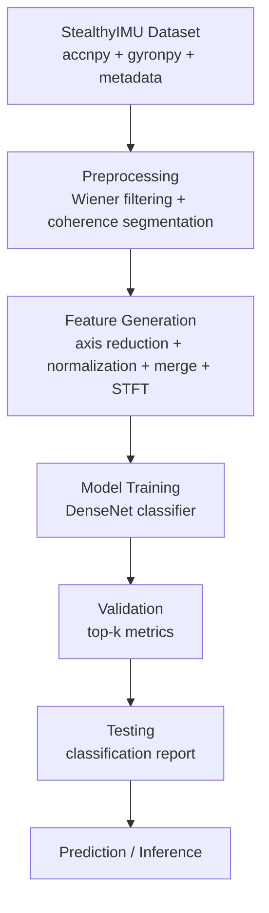
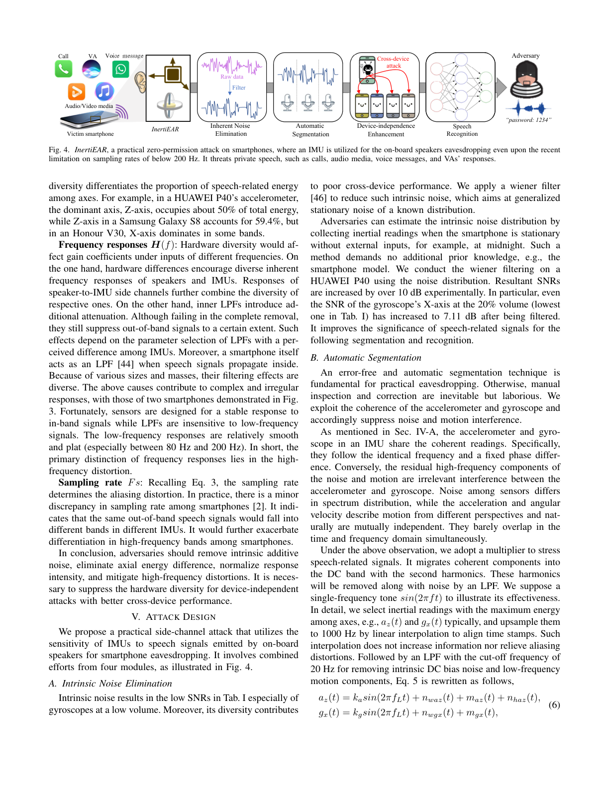
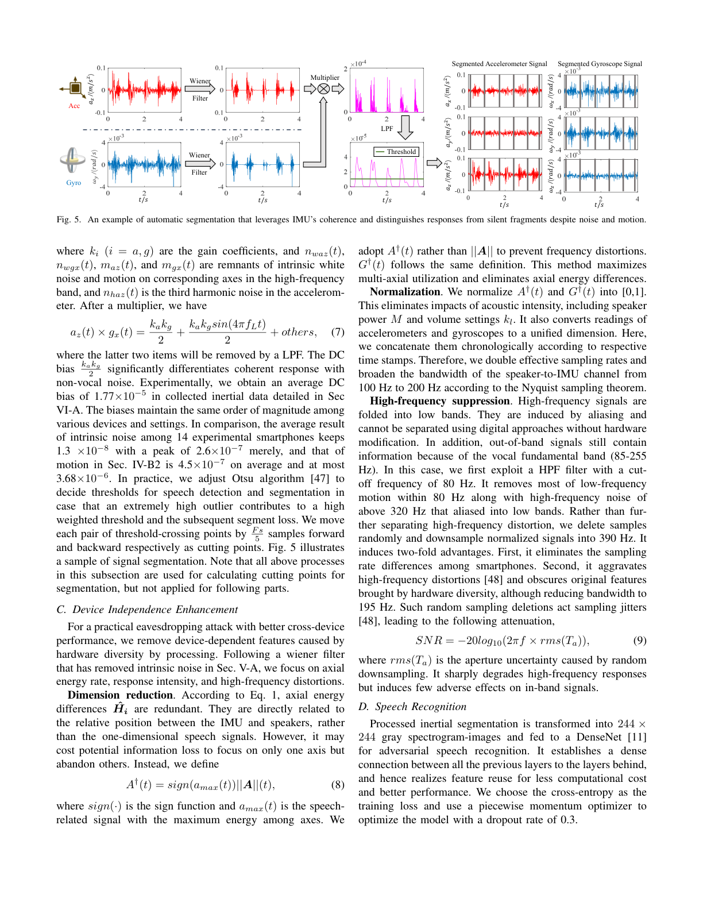
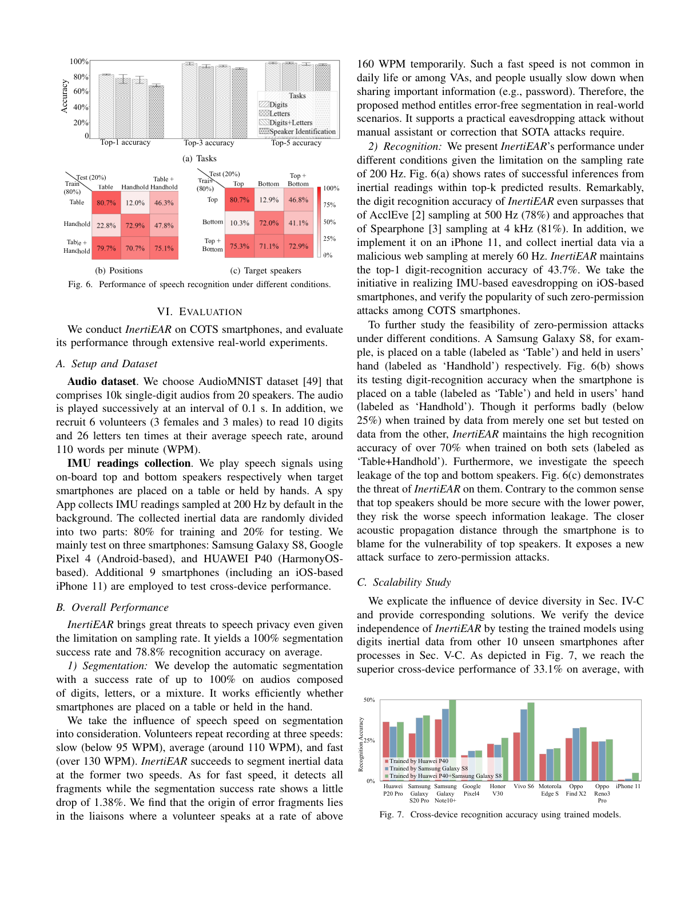
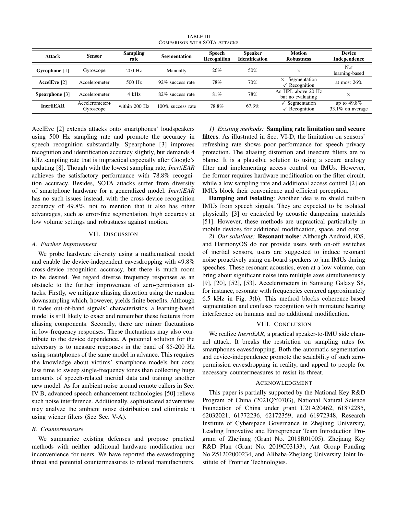

# InertiEAR Reproduction on StealthyIMU

Research-oriented implementation of an **IMU-based speech-intent inference pipeline** inspired by:

> Gao et al., *InertiEAR: Automatic and Device-independent IMU-based Eavesdropping on Smartphones* (IEEE INFOCOM 2022)  
> Local paper: [`InertiEAR_Infocom2022.pdf`](./InertiEAR_Infocom2022.pdf)

---

## Table of Contents

1. [What this project is](#what-this-project-is)
2. [Why this project exists](#why-this-project-exists)
3. [Research background and threat model](#research-background-and-threat-model)
4. [Repository structure](#repository-structure)
5. [End-to-end workflow](#end-to-end-workflow)
6. [Dataset: StealthyIMU vs original InertiEAR setup](#dataset-stealthyimu-vs-original-inertiear-setup)
7. [Implementation deep dive](#implementation-deep-dive)
8. [Model architecture](#model-architecture)
9. [Training, validation, testing, and inference](#training-validation-testing-and-inference)
10. [Evaluation methodology and metrics](#evaluation-methodology-and-metrics)
11. [Paper results and interpretation](#paper-results-and-interpretation)
12. [Reproducing experiments step-by-step](#reproducing-experiments-step-by-step)
13. [Installation (short section)](#installation-short-section)
14. [Ethics and responsible use](#ethics-and-responsible-use)
15. [Citation](#citation)

---

## What this project is

This repository implements a practical pipeline for learning speech-related information from **inertial sensor streams** (accelerometer + gyroscope), with:

- automatic signal processing,
- spectrogram feature construction,
- DenseNet-based intent classification,
- train/validation/test evaluation loops.

The codebase adapts the InertiEAR research ideas to a different dataset and problem framing (intent classes).

---

## Why this project exists

InertiEAR-style work shows that motion sensors can leak speech information even when traditional microphone permissions are not granted.  
This implementation exists to:

- study that side-channel in an ML pipeline,
- reproduce core ideas (segmentation, feature extraction, model training),
- explore cross-device robustness concepts in practice.

---

## Research background and threat model

### Core motivation (paper perspective, explained simply)

Smartphone IMUs (accelerometer/gyroscope) are often accessible with lower permission barriers than microphones. If those sensors encode speech-correlated vibrations, an adversary may infer private content.

The paper’s key claim is that even with sampling-rate restrictions, speech leakage remains exploitable due to signal characteristics (including aliasing effects and multi-sensor coherence).

### Problem the research addresses

Prior approaches struggled with:

1. **Reliable segmentation** in noisy inertial traces.
2. **Device dependence** caused by hardware diversity.

InertiEAR proposes coherence-aware processing and learning-based recognition to improve practicality.

### Assumptions (as reflected by paper + this repository’s adaptation)

- Sensor streams are available for speech playback events.
- Speech-correlated energy is present in IMU channels.
- A supervised dataset is available to train class predictions.

---

## Repository structure

> The repository tracks the core code + paper. Large datasets/artifacts are intentionally git-ignored.

```text
InertiEAR/
├── README.md
├── .gitignore
├── InertiEAR_Infocom2022.pdf
├── docs/
│   └── figures/
│       ├── paper_page5_fig4_context.png
│       ├── paper_page6_fig5_context.png
│       ├── paper_page7_eval_context.png
│       └── paper_page9_table3_context.png
├── inertiear_pipeline/
│   ├── dataset.py
│   ├── preprocessing.py
│   ├── features.py
│   ├── model.py
│   ├── train.py
│   ├── train_kaggle.py
│   └── verify_pipeline.py
└── StealthyIMU_dataset/   (local, not tracked)
    ├── data/
    ├── metadata/
    └── processed_cache/
```

### Purpose of major directories/files

| Path | Role |
|---|---|
| `inertiear_pipeline/` | Complete ML/data pipeline implementation. |
| `InertiEAR_Infocom2022.pdf` | Primary research reference for method motivation and reported benchmark performance. |
| `docs/figures/` | Extracted contextual pages from paper for inline explanation. |
| `StealthyIMU_dataset/` | Local dataset used by this implementation (not committed). |

---

## End-to-end workflow



---

## Dataset: StealthyIMU vs original InertiEAR setup

## Why StealthyIMU is used here

This repository trains on **StealthyIMU metadata/sensor files** available locally in `StealthyIMU_dataset/`, rather than reconstructing the exact custom capture setup described in the original paper.

## Important differences from paper

| Aspect | Original paper context | This repository |
|---|---|---|
| Task | Speech recognition evaluation with specific experiment setup across phones | 7-class intent-style classification from StealthyIMU metadata actions |
| Dataset | Paper’s described collection setup + AudioMNIST/volunteer protocol | `StealthyIMU_dataset` with metadata CSV and per-UUID sensor files |
| Labels | Paper reports recognition under its own datasets | `CLASS_MAP` in code: `weather, navigation, reminder, time, sun, stock, air` |
| Sampling handling | Paper discusses low-rate constraints (e.g., 200 Hz context) | Code reads raw timestamped arrays, applies custom filtering/upsampling/downsampling logic |

## Local metadata format used by code

A metadata row (from `stealthyIMU_all_relative.csv`) contains:

1. UUID
2. duration
3. wav path
4. semantic dict-like field (`action`, entities)
5. transcript text

`dataset.py` parses the `action` key to map each example into 7 classes.

## Observed class distribution (from local metadata parsing)

| Class | Count |
|---|---:|
| weather | 12,527 |
| navigation | 7,890 |
| reminder | 5,031 |
| time | 1,592 |
| sun | 1,492 |
| stock | 1,318 |
| air | 843 |
| **Total** | **30,693** |

> [!NOTE]
> Class imbalance is significant (e.g., `weather` dominates), so top-1 accuracy alone can hide minority-class failures.

## Sensor modalities and sample format

Each UUID sample uses:

- `*.accnpy`: accelerometer array (shape `(4, N)`)
- `*.gyronpy`: gyroscope array (shape `(4, M)`)

Rows are interpreted as:

- row 0: timestamp (ms)
- rows 1..3: x/y/z channels

---

## Implementation deep dive

## 1) Data loading (`dataset.py`)

- Reads CSV with pandas.
- Extracts valid rows via `parse_action`.
- Maps labels via:
  - `weather:0, navigation:1, reminder:2, time:3, sun:4, stock:5, air:6`.
- Supports:
  - disk cache (`cache_dir/*.npy`),
  - optional RAM preload (`preload_ram=True`).

Split strategy in training scripts:

- `80%` train
- `10%` validation
- `10%` test

## 2) Preprocessing (`preprocessing.py`)

Major blocks:

1. `apply_wiener_filter` (noise suppression per axis)
2. `segment_coherence`:
   - upsamples aligned signals,
   - low-pass filtering,
   - coherence multiplier,
   - low-pass envelope,
   - Otsu threshold,
   - padded segment boundaries.

Mathematically, it approximates a coherence envelope by multiplying filtered accelerometer and gyroscope traces and thresholding the resulting DC-like component.

## 3) Feature generation (`features.py`)

Pipeline:

1. **Dimension reduction** per sensor:
   \[
   s^\dagger(t) = \mathrm{sign}(s_{\max}(t)) \cdot \|S(t)\|_2
   \]
2. Min-max normalize each reduced signal.
3. Chronologically merge accel/gyro sequences.
4. High-pass filter + random downsampling (`target_fs=390` in code).
5. STFT (`n_fft=256`, `hop_length=4`), log magnitude.
6. Resize to fixed **244 × 244**.
7. Normalize to `[0, 1]`.

Output tensor shape fed to model: `(1, 244, 244)`.

## 4) Model construction (`model.py`)

`InertiEAR_DenseNet` is a DenseNet-style CNN:

- initial conv stem (`7x7`, stride 2) + maxpool,
- multiple dense blocks,
- transition layers (1x1 conv + avg pool),
- final BN + global average pooling,
- linear classifier to 7 logits.

Config examples:

- `train.py`: `block_config=(3, 6, 12, 8)` (lighter than DenseNet-121 default).
- `verify_pipeline.py`: tiny configuration for fast CPU checks.

## 5) Training/evaluation scripts

- `train.py`: local/general training.
- `train_kaggle.py`: Kaggle/multi-GPU path with AMP + `DataParallel`.
- `verify_pipeline.py`: sanity tests for all pipeline stages.

---

## Model architecture

```mermaid
flowchart LR
    X[Input Spectrogram<br/>1x244x244] --> S[Conv Stem<br/>7x7 Conv + BN + ReLU + MaxPool]
    S --> B1[DenseBlock 1]
    B1 --> T1[Transition 1]
    T1 --> B2[DenseBlock 2]
    B2 --> T2[Transition 2]
    T2 --> B3[DenseBlock 3]
    B3 --> T3[Transition 3]
    T3 --> B4[DenseBlock 4]
    B4 --> N[Final BN + ReLU]
    N --> G[Global Avg Pool]
    G --> C[Linear Classifier<br/>7 classes]
    C --> Y[Logits / Predictions]
```



### What each block does

- **DenseLayer**: bottleneck `1x1` + `3x3` conv with feature concatenation.
- **DenseBlock**: iterative feature reuse, improved gradient flow.
- **Transition**: channel compression + spatial downsampling.
- **Classifier**: maps learned representation to class probabilities.

---

## Training, validation, testing, and inference

## Training loop (implemented in `train.py` / `train_kaggle.py`)

1. Build dataloaders from split subsets.
2. Forward pass under mixed precision autocast.
3. Cross-entropy loss.
4. Backprop + optimizer step.
5. LR scheduling via `MultiStepLR`.
6. Save:
   - `checkpoint.pth` every epoch,
   - `best_model.pth` on best validation top-1.

## Validation/testing outputs

The code computes:

- top-1 / top-3 / top-5 accuracy
- `classification_report` (precision/recall/F1 per class)

## Inference path

There is no standalone `inference.py`; inference is currently done through:

- `evaluate(...)` in training scripts, or
- direct model forward pass on cached/generated spectrograms.

Minimal inference-style snippet:

```python
import torch
from inertiear_pipeline.model import InertiEAR_DenseNet

model = InertiEAR_DenseNet(growth_rate=12, block_config=(3,6,12,8), num_classes=7)
model.load_state_dict(torch.load("best_model.pth", map_location="cpu"))
model.eval()

# x shape: (batch, 1, 244, 244)
with torch.no_grad():
    logits = model(x)
    pred = logits.argmax(dim=1)
```

---

## Evaluation methodology and metrics

## Metrics currently implemented

| Metric | Implemented? | Where |
|---|---|---|
| Top-1/Top-3/Top-5 accuracy | Yes | `evaluate()` in `train.py`, `train_kaggle.py` |
| Precision / Recall / F1 (per class) | Yes | `classification_report` |
| Confusion matrix | Not yet in code | Can be added via `sklearn.metrics.confusion_matrix` |
| ROC / AUC | Not yet in code | Requires one-vs-rest probabilities |

## Why these metrics matter

- **Top-k accuracy**: useful when near-miss classes are semantically close.
- **Precision**: controls false positives per class.
- **Recall**: controls missed detections (important for minority classes).
- **F1**: balances precision/recall under class imbalance.
- **Confusion matrix** (recommended extension): reveals systematic class confusions.
- **ROC/AUC** (optional): threshold-independent separability view for each class.

---

## Paper results and interpretation

## Relevant paper figures used in this README

### Overall attack pipeline context (paper page with Fig. 4)


This page contains the high-level attack workflow concept that motivated this repository’s processing + recognition stages.

### Coherence-based segmentation context (paper page with Fig. 5)


This is the conceptual basis for `segment_coherence(...)` in `preprocessing.py`.

### Evaluation context (paper page with evaluation figures)


Used to interpret test conditions (task, position, speaker placement) in the original study.

## Reproduced markdown table from paper comparison (Table III context)



Approximate table transcription from the paper:

| Attack | Sensor | Sampling rate | Segmentation | Speech recognition | Speaker ID | Device-independence |
|---|---|---|---|---:|---:|---|
| Gyrophone [1] | Gyroscope | 200 Hz | Manual | 26% | 50% | Not learning-based |
| AccelEve [2] | Accelerometer | 500 Hz | 92% success | 78% | 70% | Recognition at most 26% |
| Spearphone [3] | Accelerometer | 4 kHz | 82% success | 81% | 78% | Not established |
| **InertiEAR** | Acc + Gyro | <= 200 Hz | **100% success** | **78.8%** | 67.3% | **Up to 49.8% cross-device** |

> [!IMPORTANT]
> This repository should be treated as an **adaptation** of the ideas, not a claim of exact benchmark replication from the paper.

---

## Reproducing experiments step-by-step

## 1) Prepare dataset

Place local data as:

- `StealthyIMU_dataset/data/...`
- `StealthyIMU_dataset/metadata/stealthyIMU_all_relative.csv`

The training scripts expect relative paths from this metadata format.

## 2) Verify pipeline components first

```bash
py -3 -m inertiear_pipeline.verify_pipeline
```

Expected output ends with:

```text
[SUCCESS] ALL VERIFICATION TESTS PASSED SUCCESSFULLY!
```

## 3) Train locally

```bash
py -3 -m inertiear_pipeline.train ^
  --csv_file StealthyIMU_dataset/metadata/stealthyIMU_all_relative.csv ^
  --data_dir StealthyIMU_dataset ^
  --cache_dir StealthyIMU_dataset/processed_cache ^
  --epochs 5 ^
  --batch_size 64 ^
  --lr 0.01 ^
  --growth_rate 12 ^
  --num_workers 4
```

## 4) Resume from checkpoint (optional)

```bash
py -3 -m inertiear_pipeline.train --resume checkpoint.pth
```

## 5) Kaggle/multi-GPU training path

```bash
py -3 -m inertiear_pipeline.train_kaggle --epochs 50 --batch_size 256
```

## 6) Evaluate

Evaluation is run at the end of training automatically and prints:

- test loss,
- top-k accuracy,
- per-class precision/recall/F1 report.

## 7) Inference

Use the loaded best model and run forward on `(1,244,244)` spectrogram tensors (see snippet above).

---

## Installation (short section)

## Environment

- Python: **3.10+** (tested here with Python 3.14 runtime)
- OS: Windows/Linux (paths in this README show Windows examples)

## Create environment (recommended)

```bash
py -3 -m venv .venv
.venv\Scripts\activate
```

## Install dependencies

```bash
py -3 -m pip install --upgrade pip
py -3 -m pip install numpy pandas scipy torch tqdm scikit-learn
```

## GPU / CUDA notes

- `train.py` works on CPU or CUDA automatically.
- `train_kaggle.py` supports multi-GPU via `nn.DataParallel`.
- Install a CUDA-compatible PyTorch build if using NVIDIA GPUs.

---

## Ethics and responsible use

This project studies a privacy-sensitive side channel.  
Use only for:

- defensive research,
- robustness evaluation,
- permission/security policy improvement.

Do **not** use for unauthorized surveillance or data extraction.

---

## Citation

If you use this repository, cite the original paper:

```bibtex
@inproceedings{gao2022inertiear,
  title={InertiEAR: Automatic and Device-independent IMU-based Eavesdropping on Smartphones},
  author={Gao, Ming and Liu, Yajie and Chen, Yike and Li, Yimin and Ba, Zhongjie and Xu, Xian and Han, Jinsong},
  booktitle={IEEE INFOCOM},
  year={2022}
}
```

