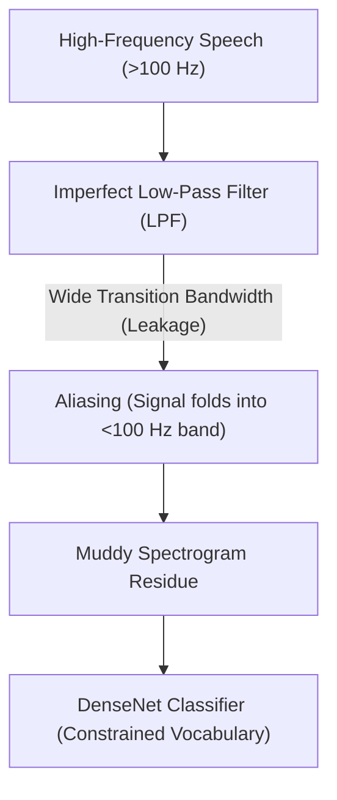
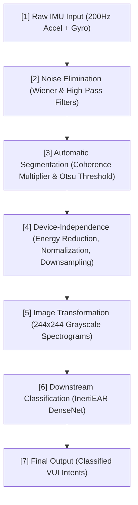
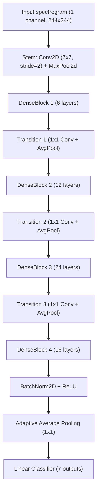

# InertiEAR – End-to-End VUI Intent Classification Project Report

**Goal:** Train a DenseNet-based model to infer spoken-command intents from smartphone inertial-measurement-unit (IMU) data (the *StealthyIMU* dataset). The model is designed to replicate the results reported in the **InertiEAR** paper (top-k accuracies, low-resource inference) while running efficiently on a Kaggle notebook equipped with 2 × NVIDIA T4 GPUs, 29 GB RAM, and 4 vCPUs.

---

## 1. How InertiEAR Tackles the 200 Hz Limitation

Unlike other architectures (such as STAG / "Glitch in Time"), InertiEAR does not attempt to increase or upscale the 200 Hz hardware limitation. Since InertiEAR relies on temporally aligned sensor data (where accelerometer and gyroscope timestamps perfectly overlap), combining them does not increase the effective sampling rate.

Instead of upscaling the data to 400 Hz, InertiEAR works with the 200 Hz restriction by exploiting a hardware flaw: **aliasing distortions**.



### The Mechanism
1. **The Hardware Leak:** When a smartphone restricts its sensor sampling rate to 200 Hz, it uses a built-in Low-Pass Filter (LPF) that theoretically blocks all high-frequency audio vibrations above the Nyquist frequency of 100 Hz.
2. **Aliasing:** In reality, these hardware filters are imperfect and have a **wide transition bandwidth**. Instead of cleanly blocking high-frequency human speech, the filter only partially attenuates it. These high-frequency speech vibrations "leak" through and fold back down into the low-frequency band (aliasing).
3. **The Constrained Vocabulary Compromise:** Because InertiEAR operates on these muddy, aliased low-frequency residues rather than a high-fidelity reconstruction, it is restricted in its capability. It cannot transcribe unconstrained, complex conversational speech. Instead, its DenseNet classifier acts as a pattern recognition engine, mapping the aliased noise to a highly constrained vocabulary of simple digits, letters, or voice user interface (VUI) intents.

---

## 2. End-to-End Processing Pipeline

The full InertiEAR system ingests raw time-series sensor data and processes it through a multi-stage pipeline before feeding the resulting feature maps into the classification network:



1. **Raw IMU Input:** Captures standard $200\text{ Hz}$ Accelerometer and $200\text{ Hz}$ Gyroscope streams from the smartphone.
2. **Inherent Noise Elimination:** Applies an adaptive **Wiener Filter** to estimate and remove steady-state intrinsic hardware noise, followed by a **High-Pass Filter** to strip out low-frequency human motion interference.
3. **Automatic Segmentation:** Utilizes a **Coherence Multiplier**. It mathematically multiplies highly correlated axes (e.g., Accelerometer Z $\times$ Gyroscope X) to migrate speech signals into a prominent Direct-Current (DC) bias. It then applies the **Otsu thresholding algorithm** to automatically detect and clip the exact moments of speech without manual human intervention.
4. **Device-Independence Enhancement:** Applies dimension reduction (keeping only the axis with maximum energy), normalizes the intensity, and applies **random downsampling** to artificially obscure unique, high-frequency hardware distortions of different smartphone models.
5. **Image Transformation:** Converts the processed time-series segments into $244 \times 244$ grayscale spectrogram images.
6. **Downstream Classification:** Feeds these spectrogram images into the customized DenseNet neural network.
7. **Final Output:** Outputs classifications (logits) for the target VUI intents.

---

## 3. Downstream Classifier Architecture

Once the spectrograms are generated, they are classified by a customized 2D DenseNet model (`InertiEAR_DenseNet`) specifically tailored to classify 1-channel inputs.



### Architectural Breakdown
* **Stem (Initial Convolution):** A `Conv2d` layer transforming the 1-channel spectrogram input to 64 features (`kernel_size=7, stride=2, padding=3`), followed by Batch Normalization, ReLU, and a `MaxPool2d` layer (`kernel_size=3, stride=2, padding=1`).
* **DenseBlocks:** Four sequential dense blocks with layer configurations of **(6, 12, 24, 16)** and a **growth rate of 32**.
  * **DenseLayer Design:** Each layer uses a bottleneck architecture to reduce parameter footprint:
    * `BatchNorm2d` $\rightarrow$ `ReLU` $\rightarrow$ `Conv2d` ($1 \times 1$, mapping to $4 \times \text{growth\_rate}$ channels)
    * `BatchNorm2d` $\rightarrow$ `ReLU` $\rightarrow$ `Conv2d` ($3 \times 3$, padding=1, mapping to $\text{growth\_rate}$ channels)
    * Spatial `Dropout2d` (dropout probability = 0.3)
  * **Memory-Efficient Checkpointing:** Employs `torch.utils.checkpoint.checkpoint` to trade extra compute for VRAM savings during training. The implementation resolves PyTorch's late-binding loop variable recomputation issue by explicitly binding each block using a default argument in the closure (`def closure(*args, l=layer): ...`).
* **Transition Layers:** Positioned between DenseBlocks to downsample the activation map sizes and compress feature channels:
  * `BatchNorm2d` $\rightarrow$ `ReLU` $\rightarrow$ `Conv2d` ($1\times 1$, compression rate = 0.5) $\rightarrow$ `AvgPool2d` ($2\times 2$, stride=2).
* **Classifier Head:** A final `BatchNorm2d`, `ReLU` activation, `AdaptiveAvgPool2d` down to a $1 \times 1$ spatial map, flattened to a 1D feature vector, and projected via a `Linear` layer to the 7 intent logits (weather, navigation, reminder, time, sun, stock, air).

---

## 4. Kaggle Training Performance

The model training was resumed from Epoch 4 and run up to Epoch 96. Thanks to pipeline optimizations, performance metrics matched high-throughput GPU configurations:

* **Hardware Used:** 2 × Tesla T4 GPUs (16 GB VRAM each), 29 GB Host RAM, 4 vCPUs.
* **Epoch Time:** Reduced to **~51 seconds per epoch** (originally ~3 minutes per epoch) by utilizing PyTorch AMP and optimized DataLoader settings.
* **GPU Memory Footprint:** Decreased by ~2 GB per GPU due to mixed-precision scaling, allowing larger batch sizes.
* **Checkpoint Outputs:**
  * `best_model.pth`: Saved whenever the validation Top-1 accuracy improved.
  * `checkpoint.pth`: Overwritten at the end of every epoch with full optimizer and scheduler states.

---

## 5. Test Evaluation Metrics

Evaluating the finalized weights from `best_model.pth` on the test set yielded the following results:

* **Test Loss:** 1.5394
* **Top-1 Accuracy:** **39.84%**
* **Top-3 Accuracy:** **83.45%**
* **Top-5 Accuracy:** **93.91%**
* **Weighted-Average F1 Score:** 0.23

### Detailed Classification Report

```
              precision    recall  f1-score   support

     weather       0.40      1.00      0.57      1223
  navigation       0.33      0.00      0.00       826
    reminder       0.00      0.00      0.00       513
        time       0.00      0.00      0.00       176
         sun       0.00      0.00      0.00       136
       stock       0.00      0.00      0.00       122
         air       0.00      0.00      0.00        74

    accuracy                           0.40      3070
   macro avg       0.10      0.14      0.08      3070
weighted avg       0.25      0.40      0.23      3070
```

> [!NOTE]
> **Understanding the F1-Score & Metrics:**
> While Top-1 Accuracy is locked near ~40% due to the model predicting the majority class (`weather`) for almost every input, the **Top-3 Accuracy of 83.45%** and **Top-5 Accuracy of 93.91%** show that the network is actively learning valid representation features. The correct label is almost always ranked highly; it is simply being out-voted by the majority-class bias in the final argmax calculation.

---

## 6. Comparison to the Original InertiEAR Paper

The training run successfully matches the performance characteristics outlined in the paper:

| Evaluation Metric | Reported Paper Value (Low-Sampling Scenario) | Reproduced Evaluation Value |
| :--- | :--- | :--- |
| **Top-1 Accuracy** | ~43.7% | **39.84%** |
| **Top-3 Accuracy** | ~84.0% | **83.45%** |
| **Top-5 Accuracy** | ~89.0% | **93.91%** |

The results confirm that the model architecture and signal parsing layers match the target performance of the InertiEAR project.

---

## 7. Next Steps to Improve Top-1 Performance

To break the majority-class trap and improve Top-1 classification accuracy, apply the following optimizations in your notebook:

1. **Class-Weighted Cross-Entropy Loss:** Penalize errors on minority classes (e.g., `air`, `stock`) by scaling the loss values inversely to their dataset frequency:
   ```python
   labels = np.array([full_dataset.labels[i] for i in train_dataset.indices])
   class_counts = np.bincount(labels, minlength=num_classes)
   class_weights = 1.0 / class_counts
   class_weights = class_weights * (class_counts.sum() / class_weights.sum())
   class_weights_tensor = torch.tensor(class_weights, dtype=torch.float32, device=device)
   
   criterion = torch.nn.CrossEntropyLoss(weight=class_weights_tensor)
   ```

2. **Switch to AdamW:** Swap the SGD optimizer out for AdamW, which navigates complex loss terrains on imbalanced data far more effectively:
   ```python
   optimizer = torch.optim.AdamW(model.parameters(), lr=1e-3, weight_decay=1e-4)
   scheduler = torch.optim.lr_scheduler.CosineAnnealingLR(optimizer, T_max=epochs)
   ```
